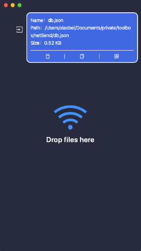

# NetSend

一个基于 umijs + electron + javascript 构建的内网文件传输工具

## 功能介绍




支持跨系统，跨终端设备传输，没有大小限制，只要在同一局域网下就可以

## 开发介绍

### 项目结构

```ssh
.
|-- build
|   |-- icon.icns                         // 打包后程序图标 MacOS
|   |-- icon.ico                          // 打包后程序图标 Windows
|   |-- webpack.base.config.js            // electron-webpack 基础配置
|   |-- webpack.main.config.js            // electron-webpack 开发配置
|   `-- webpack.main.prod.config.js       // electron-webpack 正式配置
|-- dist                                  // 项目编译输出目录
|   |-- main                              // 主程序编译目录
|   `-- renderer                          // 页面编译目录
|-- release                               // 打包输出目录
|-- src                                   // 开发目录
|   |-- main                              // 主程序目录
|   |   -- main.js                        // 主程序入口
|   |   -- koa.js                         // koa server
|   |   -- db.js                          // 简单的数据存储
|   |   -- helper.js                      // 公用方法
|   `-- renderer                          // React项目页面
|       |-- assets
|       |-- config
|       |   |-- config.js                 // umijs配置
|       |-- pages
|           `-- index.js
|       |-- public
|           `-- renderer.js               // 如果需要引用node的api，需要在这个js里面提前引入
|-- package.json                          // 项目依赖以及打包配置
`-- README.md                             // 项目说明文档
```

### 环境搭建

#### 安装

然后通过 yarn 下载依赖

```javascript
  $ yarn
```

#### 开发

首先通过以下命令启动渲染进程(默认端口：8000)

```javascript
  $ yarn start:renderer
```

然后启动主进程

```javascript
  $ yarn start:main
```

#### 打包

```javascript
  $ npm run pack  // 打包macOS
  $ npm run exe   // 打包windows
```

如果想把代码打包成一个 dmg 文件或者 zip 文件，可以执行以下命令

```javascript
  $ npm run dist
```
